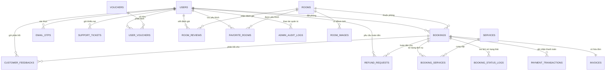
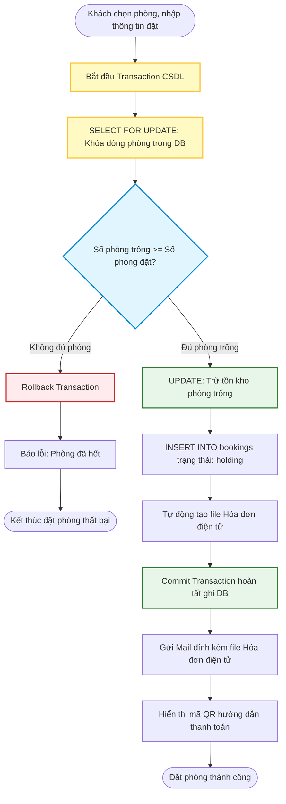
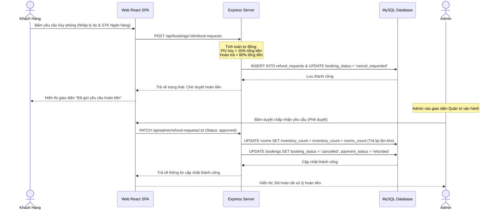

# BÁO CÁO ĐỒ ÁN MÔN HỌC: PHÁT TRIỂN ỨNG DỤNG WEB
## ĐỀ TÀI: XÂY DỰNG HỆ THỐNG ĐẶT PHÒNG KHÁCH SẠN TRỰC TUYẾN STAYNEST

---

<div align="center">
  <p><strong>BỘ GIÁO DỤC VÀ ĐÀO TẠO</strong></p>
  <p><strong>TRƯỜNG ĐẠI HỌC KIẾN TRÚC HÀ NỘI</strong></p>
  <p><strong>KHOA CÔNG NGHỆ THÔNG TIN</strong></p>
  <br/>
  
  <br/>
  <br/>
  <h3>BÁO CÁO ĐỒ ÁN MÔN HỌC</h3>
  <h2>PHÁT TRIỂN ỨNG DỤNG WEB</h2>
  <br/>
  <p><strong>ĐỀ TÀI:</strong></p>
  <h1>XÂY DỰNG HỆ THỐNG ĐẶT PHÒNG KHÁCH SẠN TRỰC TUYẾN STAYNEST</h1>
  <br/>
  <br/>
  <table style="width: auto; margin: 0 auto; text-align: left; border: none;">
    <tr>
      <td><strong>Thành viên thực hiện:</strong></td>
      <td>Nhóm 1 - Lớp 23CN4</td>
    </tr>
    <tr>
      <td>1. <strong>Lê Huy Hoàng</strong></td>
      <td>- MSV: 2355010084 (Nhóm trưởng)</td>
    </tr>
    <tr>
      <td>2. <strong>Lê Quang Trung</strong></td>
      <td>- MSV: 2355010200</td>
    </tr>
    <tr>
      <td>3. <strong>Trần Văn Bảo</strong></td>
      <td>- MSV: 2355010024</td>
    </tr>
    <tr>
      <td>4. **Nguyễn Trần Tuấn Anh**</td>
      <td>- MSV: 2355010012</td>
    </tr>
    <tr>
      <td>5. **Phạm Ngọc Sơn**</td>
      <td>- MSV: 2355010017</td>
    </tr>
    <tr>
      <td><strong>Giảng viên hướng dẫn:</strong></td>
      <td>Th.S Nguyễn Đình Thái</td>
    </tr>
  </table>
  <br/>
  <br/>
  <p><i>Hà Nội, Tháng 5 Năm 2026</i></p>
</div>

---

## MỤC LỤC

- [LỜI MỞ ĐẦU](#lời-mở-đầu)
- [DANH MỤC HÌNH ẢNH VÀ CÁC SƠ ĐỒ](#danh-mục-hình-ảnh-và-các-sơ-đồ)
- [DANH MỤC CÁC TỪ VIẾT TẮT](#danh-mục-các-từ-viết-tắt)
- [CHƯƠNG 1. GIỚI THIỆU CHUNG VỀ HỆ THỐNG ĐẶT PHÒNG KHÁCH SẠN](#chương-1-giới-thiệu-chung-về-hệ-thống-đặt-phòng-khách-sạn)
  - [1.1. Lý do chọn đề tài](#11-lý-do-chọn-đề-tài)
  - [1.2. Mục tiêu nghiên cứu và phát triển](#12-mục-tiêu-nghiên-cứu-và-phát-triển)
  - [1.3. Phạm vi nghiên cứu của đề tài](#13-phạm-vi-nghiên-cứu-của-đề-tài)
  - [1.4. Đối tượng sử dụng hệ thống](#14-đối-tượng-sử-dụng-hệ-thống)
  - [1.5. Phương pháp tiếp cận và nghiên cứu](#15-phương-pháp-tiếp-cận-và-nghiên-cứu)
  - [1.6. Cấu trúc của báo cáo](#16-cấu-trúc-của-báo-cáo)
- [CHƯƠNG 2. CƠ SỞ LÝ THUYẾT VÀ CÔNG NGHỆ SỬ DỤNG](#chương-2-cơ-sở-lý-thuyết-và-công-nghệ-sử-dụng)
  - [2.1. Nền tảng Frontend: ReactJS và Zustand State Management](#21-nền-tảng-frontend-reactjs-và-zustand-state-management)
  - [2.2. Nền tảng Backend: Node.js \& Express API Framework](#22-nền-tảng-backend-nodejs-express-api-framework)
  - [2.3. Hệ quản trị cơ sở dữ liệu MySQL](#23-hệ-quản-trị-cơ-sở-dữ-liệu-mysql)
  - [2.4. Các giao thức \& Cơ chế bảo mật](#24-các-giao-thức--cơ-chế-bảo-mật)
  - [2.5. Kiến trúc tổng quan hệ thống Web 3 lớp](#25-kiến-trúc-tổng-quan-hệ-thống-web-3-lớp)
- [CHƯƠNG 3. PHÂN TÍCH VÀ THIẾT KẾ HỆ THỐNG](#chương-3-phân-tích-và-thiết-kế-hệ-thống)
  - [3.1. Khảo sát quy trình nghiệp vụ thực tế](#31-khảo-sát-quy-trình-nghiệp-vụ-thực-tế)
  - [3.2. Phân tích yêu cầu chức năng (Use Case Diagram)](#32-phân-tích-yêu-cầu-chức-năng-use-case-diagram)
  - [3.3. Thiết kế Cơ sở dữ liệu (Database Design \& Data Dictionary)](#33-thiết-kế-cơ-sở-dữ-liệu-database-design--data-dictionary)
  - [3.4. Sơ đồ tuần tự và luồng hoạt động (Sequence \& Activity Diagrams)](#34-sơ-đồ-tuần-tự-và-luồng-hoạt-động-sequence--activity-diagrams)
- [CHƯƠNG 4. HIỆN THỰC HÓA CHI TIẾT VÀ THỬ NGHIỆM HỆ THỐNG](#chương-4-hiện-thực-hóa-chi-tiết-và-thử-nghiệm-hệ-thống)
  - [4.1. Cấu trúc mã nguồn hệ thống](#41-cấu-trúc-mã-nguồn-hệ-thống)
  - [4.2. Mã nguồn \& Giải thuật cốt lõi](#42-mã-nguồn--giải-thuật-cốt-lõi)
  - [4.3. Kịch bản kiểm thử hệ thống (Test Cases)](#43-kịch-bản-kiểm-thử-hệ-thống-test-cases)
  - [4.4. Kết quả thực nghiệm và Giao diện demo](#44-kết-quả-thực-nghiệm-và-giao-diện-demo)
- [KẾT LUẬN VÀ HƯỚNG PHÁT TRIỂN](#kết-luận-với-hướng-phát-triển)
- [TÀI LIỆU THAM KHẢO](#tài-liệu-tham-khảo)
- [PHÂN CHIA CÔNG VIỆC TRONG NHÓM](#phân-chia-công-việc-trong-nhóm)

---

## LỜI MỞ ĐẦU

Trong bối cảnh nền kinh tế số ngày càng mở rộng và phát triển mạnh mẽ, ngành du lịch và dịch vụ lưu trú khách sạn đã chứng kiến sự chuyển dịch đột phá từ phương thức vận hành truyền thống sang mô hình trực tuyến. Sự phổ biến của các trang mạng đặt phòng toàn cầu và nhu cầu tự phục vụ cao từ phía người dùng đã tạo nên yêu cầu cấp bách buộc các đơn vị kinh doanh lưu trú phải sở hữu hệ thống quản lý và giao dịch riêng biệt, hiệu quả và tối ưu hóa tính bảo mật thông tin.

Nhận thức được tầm quan trọng này, nhóm chúng em đã phát triển đề tài **"Xây dựng hệ thống đặt phòng khách sạn trực tuyến StayNest"**. Đây là một bước cải tiến vượt bậc so với phiên bản phần mềm quản lý WinForms trên Desktop trước đó. Hệ thống mới được triển khai trên mô hình kiến trúc Web đa tầng hiện đại: **ReactJS** mang đến trải nghiệm người dùng tối ưu ở Frontend, kết hợp với sức mạnh bất đồng bộ của **Node.js/Express** ở Backend, và sự tin cậy cao về toàn vẹn dữ liệu của hệ quản trị cơ sở dữ liệu quan hệ **MySQL**.

Đồ án tập trung giải quyết các bài toán kỹ thuật nâng cao bao gồm: kiểm soát đồng thời (Concurrency Control) để tránh hiện tượng đặt trùng phòng (Overbooking / Race Condition) khi có tải cao, cơ chế đăng ký và kích hoạt tài khoản an toàn sử dụng mã OTP gửi qua Email thời gian thực, băm mật khẩu bảo mật, kiến trúc Stateless Session sử dụng Token JWT, và quy trình tự động hóa tính phí phạt khi hủy đơn hoặc phê duyệt yêu cầu hoàn tiền.

Chúng em xin bày tỏ lòng biết ơn sâu sắc tới **Th.S Nguyễn Đình Thái** cùng các thầy cô giáo trong Khoa Công nghệ Thông tin - Trường Đại học Kiến trúc Hà Nội đã truyền đạt kiến thức và tận tình hướng dẫn để nhóm hoàn thành báo cáo này. Dù có nhiều cố gắng, báo cáo và hệ thống chắc chắn không tránh khỏi những thiếu sót. Chúng em rất mong nhận được những ý kiến đóng góp quý báu từ thầy cô để hoàn thiện đề tài tốt hơn.

*Nhóm sinh viên thực hiện.*

---

## DANH MỤC HÌNH ẢNH VÀ CÁC SƠ ĐỒ

*   **Hình 2.1:** Kiến trúc phân tầng hệ thống Web 3 lớp (3-tier Architecture).
*   **Hình 3.1:** Biểu đồ Use Case tổng quát hệ thống StayNest.
*   **Hình 3.2:** Sơ đồ mối quan hệ thực thể (ERD - Entity Relationship Diagram).
*   **Hình 3.3:** Biểu đồ hoạt động của Luồng giao dịch đặt phòng an toàn.
*   **Hình 3.4:** Biểu đồ tuần tự luồng Yêu cầu hoàn tiền và hủy đơn đã thanh toán.
*   **Hình 4.1:** Cấu trúc tổ chức thư mục của dự án Frontend và Backend.
*   **Hình 4.2:** Giao diện Trang chủ khách hàng và bộ lọc tìm kiếm phòng.
*   **Hình 4.3:** Giao diện Trang chi tiết phòng và quy trình chọn dịch vụ đi kèm.
*   **Hình 4.4:** Giao diện Quản trị viên Dashboard thống kê doanh thu tức thời.

---

## DANH MỤC CÁC TỪ VIẾT TẮT

| Từ viết tắt | Thuật ngữ đầy đủ (Tiếng Anh) | Ý nghĩa (Tiếng Việt) |
| :--- | :--- | :--- |
| **API** | Application Programming Interface | Giao diện lập trình ứng dụng |
| **SPA** | Single Page Application | Ứng dụng web đơn trang |
| **JWT** | JSON Web Token | Mã thông báo định danh chuẩn JSON |
| **OTP** | One-Time Password | Mật khẩu sử dụng một lần |
| **DB** | Database | Cơ sở dữ liệu |
| **RDBMS** | Relational Database Management System | Hệ quản trị cơ sở dữ liệu quan hệ |
| **CSDL** | Cơ Sở Dữ Liệu | Hệ thống lưu trữ dữ liệu có cấu trúc |
| **HTML/CSS**| HyperText Markup Language / Cascading Style Sheets | Ngôn ngữ cấu trúc & giao diện Web |
| **UI/UX** | User Interface / User Experience | Giao diện người dùng / Trải nghiệm người dùng |

---

## CHƯƠNG 1. GIỚI THIỆU CHUNG VỀ HỆ THỐNG ĐẶT PHÒNG KHÁCH SẠN

### 1.1. Lý do chọn đề tài
Trong thời đại số hóa, các dịch vụ đặt phòng trực tuyến (Booking Online) đã trở thành phương thức giao dịch chính yếu trong ngành khách sạn. Khách hàng luôn mong muốn sự tiện lợi khi tìm kiếm, so sánh giá cả, đặt phòng và thực hiện thanh toán chuyển khoản mọi lúc mọi nơi mà không cần qua trung gian hoặc gọi điện trực tiếp.

Tuy nhiên, các hệ thống quản lý truyền thống gặp nhiều hạn chế như:
1. Giao diện Desktop tĩnh khó tiếp cận từ xa, thiếu khả năng đồng bộ trạng thái thời gian thực.
2. Nguy cơ xảy ra tranh chấp dữ liệu (Race Condition) dẫn đến hiện tượng đặt trùng phòng (Overbooking).
3. Thiếu cơ chế tự động hóa quy trình quản lý của Admin như duyệt thanh toán trực tuyến, hoàn tiền tự động theo biểu phí phạt rõ ràng và phản hồi khiếu nại.

Từ thực trạng đó, nhóm quyết định xây dựng hệ thống **StayNest** dựa trên nền tảng Full-stack Web hiện đại để giải quyết triệt để các bài toán nghiệp vụ này một cách chuyên nghiệp.

### 1.2. Mục tiêu nghiên cứu và phát triển
*   **Về mặt kỹ thuật:** Thiết kế một hệ thống Web SPA mượt mà, hiệu năng cao, cơ chế API bảo mật, cấu trúc cơ sở dữ liệu chuẩn hóa hạn chế tối đa dư thừa dữ liệu.
*   **Về mặt nghiệp vụ:** Hiện thực hóa quy trình khép kín từ Đăng ký xác thực OTP $\rightarrow$ Chọn phòng và dịch vụ $\rightarrow$ Đặt phòng giữ chỗ $\rightarrow$ Áp dụng mã Voucher giảm giá $\rightarrow$ Thanh toán $\rightarrow$ Nhận phòng qua mã QR $\rightarrow$ Đánh giá trải nghiệm hoặc yêu cầu hủy phòng/hoàn tiền.

### 1.3. Phạm vi nghiên cứu của đề tài
Dự án tập trung xây dựng trọn vẹn cả hai phân hệ lớn:
*   **Phân hệ Khách hàng:** Chạy trên trình duyệt web, tương thích tốt với mọi thiết bị di động (Responsive Web Design).
*   **Phân hệ Admin (Quản trị vận hành):** Dashboard tổng hợp doanh thu, quản lý danh sách phòng, điều phối đơn đặt phòng, phê duyệt hoàn tiền và phản hồi hỗ trợ khách hàng.

### 1.4. Đối tượng sử dụng hệ thống
1.  **Khách hàng vãng lai / Khách hàng thành viên:** Người dùng có nhu cầu tìm kiếm, đặt chỗ và thanh toán.
2.  **Nhân viên lễ tân / Admin quản trị:** Người kiểm soát vận hành, xác nhận thông tin thực tế, cập nhật phòng trống, giải quyết các sự cố thanh toán và khiếu nại của khách hàng.

### 1.5. Phương pháp tiếp cận và nghiên cứu
*   Tìm hiểu các giải pháp chống Race Condition trong hệ quản trị cơ sở dữ liệu quan hệ (RDBMS).
*   Nghiên cứu mô hình thiết kế RESTful API tiêu chuẩn.
*   Áp dụng các thư viện bảo mật cao như `bcryptjs`, `jsonwebtoken` và dịch vụ gửi mail tự động `nodemailer`.

### 1.6. Cấu trúc của báo cáo
Báo cáo được chia thành 4 chương chính:
*   **Chương 1:** Giới thiệu chung về đề tài.
*   **Chương 2:** Tổng quan về cơ sở lý thuyết và các công nghệ sử dụng trong hệ thống.
*   **Chương 3:** Phân tích yêu cầu chức năng, thiết kế biểu đồ Use Case, ERD và các biểu đồ hoạt động luồng dữ liệu.
*   **Chương 4:** Cấu trúc thư mục code thực tế, hiện thực giải thuật chống đặt trùng phòng, kịch bản kiểm thử và giao diện hệ thống.

---

## CHƯƠNG 2. CƠ SỞ LÝ THUYẾT VÀ CÔNG NGHỆ SỬ DỤNG

### 2.1. Nền tảng Frontend: ReactJS và Zustand State Management
*   **ReactJS:** Là thư viện JavaScript phổ biến do Meta phát triển, hướng component tái sử dụng (Reusable Components), tối ưu tốc độ kết xuất trang nhờ Virtual DOM. 
*   **Zustand:** Thư viện quản lý trạng thái (State Management) tối giản nhưng mạnh mẽ, giúp đồng bộ phiên đăng nhập của người dùng (`auth`) và thông tin giỏ hàng/thanh toán mà không gây lag/chậm UI như Redux.

### 2.2. Nền tảng Backend: Node.js & Express API Framework
*   **Node.js:** Môi trường chạy mã JavaScript phía máy chủ, sử dụng mô hình non-blocking I/O và kiến trúc hướng sự kiện, cực kỳ phù hợp cho các luồng xử lý IO nặng như ghi file PDF hóa đơn và gửi email OTP.
*   **ExpressJS:** Web framework gọn nhẹ chạy trên Node.js, cung cấp cơ chế Middleware mạnh mẽ để phân quyền người dùng và định tuyến API rõ ràng.

### 2.3. Hệ quản trị cơ sở dữ liệu MySQL
Hệ thống lựa chọn MySQL làm RDBMS chính vì tính ổn định cao và khả năng hỗ trợ ACID Transactions đầy đủ. Tính năng khóa dòng (`SELECT ... FOR UPDATE`) của Storage Engine InnoDB đóng vai trò quyết định trong việc đảm bảo không bao giờ xảy ra Overbooking khi hệ thống bị quá tải lượng request đồng thời.

### 2.4. Các giao thức & Cơ chế bảo mật
1.  **JWT (JSON Web Token):** Token mã hóa dưới dạng chuỗi Base64 gồm 3 phần (Header, Payload, Signature) giúp truyền thông tin người dùng an toàn giữa Client và Server mà không cần lưu phiên trên session máy chủ (Stateless Session).
2.  **Mã hóa bcrypt:** Sử dụng cơ chế băm mật khẩu một chiều với salt ngẫu nhiên để chống lại các cuộc tấn công brute force và xem trộm mật khẩu trực tiếp trong Database.
3.  **Mã xác thực OTP qua Nodemailer:** Đảm bảo hòm mail đăng ký của khách hàng là có thật, ngăn ngừa tài khoản ảo rác phá hoại hệ thống.

### 2.5. Kiến trúc tổng quan hệ thống Web 3 lớp
Hệ thống được tổ chức theo kiến trúc 3 lớp chuẩn mực (3-tier Architecture) để tăng tính mở rộng độc lập giữa các thành phần:

```mermaid
graph TD
    subgraph Tầng Giao Diện (Presentation Layer)
        React[ReactJS Single Page Application]
        Zustand[Zustand Local State Manager]
        React <--> Zustand
    end

    subgraph Tầng Nghiệp Vụ (Application Server Layer)
        Express[Express Route Handlers]
        Services[Business Logic Service Classes]
        Middlewares[Auth & Validation Middlewares]
        Express --> Middlewares
        Middlewares --> Services
    end

    subgraph Tầng Dữ Liệu (Database Layer)
        MySQL[(MySQL Relational DB)]
        Invoices[(HTML/PDF Storage)]
    end

    React <-->|HTTPS / JSON REST API| Express
    Services <-->|Connection Pool / SQL| MySQL
    Services <-->|File System I/O| Invoices
    
    %% Style nodes
    style React fill:#61dafb,stroke:#333,stroke-width:2px,color:#000
    style Zustand fill:#db7093,stroke:#333,stroke-width:2px,color:#fff
    style Express fill:#82b1ff,stroke:#333,stroke-width:2px,color:#000
    style Services fill:#b3e5fc,stroke:#333,stroke-width:2px,color:#000
    style Middlewares fill:#cfd8dc,stroke:#333,stroke-width:2px,color:#000
    style MySQL fill:#ffe082,stroke:#333,stroke-width:2px,color:#000
    style Invoices fill:#ffcc80,stroke:#333,stroke-width:2px,color:#000
```

---

## CHƯƠNG 3. PHÂN TÍCH VÀ THIẾT KẾ HỆ THỐNG

### 3.1. Khảo sát quy trình nghiệp vụ thực tế
Trong mô hình quản lý truyền thống, khách hàng phải đến tận nơi hoặc liên hệ qua điện thoại, lễ tân kiểm tra sổ sách thủ công. Việc áp dụng mã giảm giá và tính toán hoàn phí khi hủy đơn rất phức tạp, dễ gây sai sót thất thoát tài chính.
Hệ thống **StayNest** số hóa toàn bộ quy trình: Khách hàng xem phòng trống tức thì, áp dụng voucher tự động theo điều kiện giá trị đơn hàng, nhận hóa đơn điện tử tự động gửi trực tiếp vào hòm mail và tự tạo phiếu yêu cầu hủy phòng nếu có thay đổi lịch trình.

### 3.2. Phân tích yêu cầu chức năng (Use Case Diagram)
Hệ thống phân chia rõ quyền hạn của 2 tác nhân chính:

```mermaid
leftToRightDirection
actor Khách_Hàng as Customer
actor Quản_Trị_Viên as Admin

rectangle Hệ_Thống_StayNest {
    Customer --> (Đăng ký tài khoản / Xác minh OTP)
    Customer --> (Tìm kiếm phòng theo thành phố/ngày trống)
    Customer --> (Đặt phòng & Chọn dịch vụ đi kèm)
    Customer --> (Thanh toán chuyển khoản VietQR)
    Customer --> (Gửi yêu cầu hoàn tiền)
    Customer --> (Gửi khiếu nại & hỗ trợ)

    Admin --> (Quản trị trạng thái khách hàng)
    Admin --> (Duyệt yêu cầu hoàn tiền & giải phóng phòng)
    Admin --> (Xử lý khiếu nại khách hàng)
    Admin --> (Theo dõi thống kê doanh thu Dashboard)
}

%% Style diagram
style Customer fill:#ffecb3,stroke:#ffb300,stroke-width:2px
style Admin fill:#c8e6c9,stroke:#388e3c,stroke-width:2px
```

#### Đặc tả chi tiết các Use Case chính

##### A. Use Case: Đăng ký tài khoản & Xác minh OTP
*   **Tác nhân:** Khách hàng (Customer)
*   **Mục đích:** Đăng ký tài khoản mới hợp lệ trên hệ thống.
*   **Tiền điều kiện:** Email chưa từng được đăng ký trong hệ thống.
*   **Luồng sự kiện chính:**
    1. Khách hàng nhập thông tin gồm Tên, Tên đăng nhập, Email, Mật khẩu và Số điện thoại.
    2. Hệ thống kiểm tra trùng lặp thông tin đăng nhập và email trong bảng `users`.
    3. Hệ thống tạo tài khoản ở trạng thái `email_verified = FALSE`.
    4. Hệ thống tự động gửi email chứa mã OTP gồm 6 chữ số có hiệu lực trong 10 phút.
    5. Người dùng nhập OTP trên giao diện Web.
    6. Hệ thống xác thực trùng khớp OTP, kích hoạt trạng thái tài khoản thành `email_verified = TRUE`.

##### B. Use Case: Tạo đặt phòng (Booking)
*   **Tác nhân:** Khách hàng (Customer)
*   **Tiền điều kiện:** Khách hàng đã đăng nhập và tài khoản đã được xác minh email.
*   **Luồng sự kiện chính:**
    1. Khách hàng chọn phòng, ngày nhận/trả và số lượng phòng cần đặt.
    2. Hệ thống kiểm tra số lượng tồn kho khả dụng của phòng bằng Transaction an toàn.
    3. Nếu đủ phòng, hệ thống trừ tồn kho, tạo bản ghi đặt chỗ ở trạng thái `holding` và tự động sinh hóa đơn điện tử đính kèm mã QR.
    4. Khách hàng thực hiện thanh toán chuyển khoản trong thời hạn giữ chỗ 15 phút.

---

### 3.3. Thiết kế Cơ sở dữ liệu (Database Design & Data Dictionary)

Dưới đây là sơ đồ mối quan hệ thực thể (ERD) biểu diễn liên kết dữ liệu giữa các nghiệp vụ đặt phòng, dịch vụ, hóa đơn, hoàn tiền và khiếu nại của hệ thống StayNest:



#### TỪ ĐIỂN DỮ LIỆU CHI TIẾT (14 BẢNG CỐT LÕI)

##### 1. Bảng `users` (Thông tin tài khoản khách hàng và quản trị viên)
| Tên cột | Kiểu dữ liệu | Ràng buộc | Mô tả |
| :--- | :--- | :--- | :--- |
| `id` | BIGINT | PRIMARY KEY, AUTO_INCREMENT | Khóa chính tự tăng |
| `full_name` | VARCHAR(120) | NOT NULL | Họ và tên hiển thị của người dùng |
| `username` | VARCHAR(80) | NOT NULL, UNIQUE | Tên đăng nhập hệ thống |
| `email` | VARCHAR(150) | NOT NULL, UNIQUE | Địa chỉ hòm thư điện tử |
| `password_hash` | VARCHAR(255) | NOT NULL | Mật khẩu băm an toàn (bcrypt) |
| `phone` | VARCHAR(20) | NULL | Số điện thoại liên hệ |
| `avatar_url` | VARCHAR(500) | NULL | Đường dẫn ảnh đại diện |
| `email_verified`| BOOLEAN | NOT NULL, DEFAULT FALSE | Trạng thái xác thực hòm thư điện tử |
| `role` | ENUM | NOT NULL, DEFAULT 'customer' | Vai trò: 'customer' hoặc 'admin' |
| `status` | ENUM | NOT NULL, DEFAULT 'active' | Trạng thái: 'active' (hoạt động) hoặc 'inactive' (khóa) |
| `last_login_at` | TIMESTAMP | NULL | Thời gian lần cuối cùng đăng nhập |
| `created_at` | TIMESTAMP | DEFAULT CURRENT_TIMESTAMP | Thời gian khởi tạo tài khoản |
| `updated_at` | TIMESTAMP | DEFAULT CURRENT_TIMESTAMP ON UPDATE | Thời gian cập nhật tài khoản gần nhất |

##### 2. Bảng `rooms` (Danh mục thông tin các phòng nghỉ)
| Tên cột | Kiểu dữ liệu | Ràng buộc | Mô tả |
| :--- | :--- | :--- | :--- |
| `id` | BIGINT | PRIMARY KEY, AUTO_INCREMENT | Khóa chính tự tăng |
| `hotel_name` | VARCHAR(150) | NOT NULL | Tên cơ sở khách sạn |
| `room_name` | VARCHAR(150) | NOT NULL | Tên hoặc số phòng cụ thể |
| `slug` | VARCHAR(180) | NOT NULL, UNIQUE | Đường dẫn thân thiện URL (slug) |
| `city` | VARCHAR(100) | NOT NULL | Thành phố trực thuộc |
| `address` | VARCHAR(255) | NOT NULL | Địa chỉ chi tiết |
| `room_type` | ENUM | NOT NULL | Hạng phòng: 'standard', 'deluxe', 'superior', 'suite', 'family' |
| `description` | TEXT | NULL | Mô tả chi tiết về phòng nghỉ |
| `amenities_json`| JSON | NULL | Danh sách tiện ích dưới dạng mảng JSON |
| `image_url` | VARCHAR(500) | NULL | Đường dẫn ảnh đại diện chính của phòng |
| `gallery_json` | JSON | NULL | Danh sách ảnh chi tiết dạng mảng JSON |
| `price_per_night`| DECIMAL(12,2) | NOT NULL | Giá thuê phòng một đêm |
| `rating_avg` | DECIMAL(3,1) | NOT NULL, DEFAULT 0 | Điểm đánh giá trung bình từ khách hàng |
| `total_reviews` | INT | NOT NULL, DEFAULT 0 | Tổng số lượt khách hàng đánh giá |
| `max_guests` | INT | NOT NULL | Số lượng khách tối đa được ở |
| `inventory_count`| INT | NOT NULL, DEFAULT 1 | Số lượng phòng trống khả dụng |
| `breakfast_included`| BOOLEAN | NOT NULL, DEFAULT FALSE| Trạng thái kèm ăn sáng miễn phí |
| `free_cancellation`| BOOLEAN | NOT NULL, DEFAULT FALSE | Trạng thái cho phép hủy phòng miễn phí |
| `is_active` | BOOLEAN | NOT NULL, DEFAULT TRUE | Trạng thái đang kinh doanh |

##### 3. Bảng `bookings` (Thông tin chi tiết các đơn đặt phòng)
| Tên cột | Kiểu dữ liệu | Ràng buộc | Mô tả |
| :--- | :--- | :--- | :--- |
| `id` | BIGINT | PRIMARY KEY, AUTO_INCREMENT | Khóa chính tự tăng |
| `booking_code` | VARCHAR(50) | NOT NULL, UNIQUE | Mã đặt phòng hiển thị (ví dụ: SN-2026...) |
| `user_id` | BIGINT | FOREIGN KEY (`users`) | ID người thực hiện đặt phòng |
| `room_id` | BIGINT | FOREIGN KEY (`rooms`) | ID phòng nghỉ được chọn thuê |
| `check_in_date` | DATE | NOT NULL | Ngày nhận phòng dự kiến |
| `check_out_date`| DATE | NOT NULL | Ngày trả phòng dự kiến |
| `guests` | INT | NOT NULL | Số lượng khách lưu trú thực tế |
| `rooms_count` | INT | NOT NULL, DEFAULT 1 | Số lượng phòng khách chọn thuê |
| `booking_type` | ENUM | NOT NULL, DEFAULT 'overnight'| Loại thuê: 'overnight' (qua đêm) hoặc 'day_use' (trong ngày) |
| `nights` | INT | NOT NULL | Tổng số đêm nghỉ lưu trú |
| `room_price` | DECIMAL(12,2) | NOT NULL | Giá phòng một đêm áp dụng tại lúc đặt |
| `service_price` | DECIMAL(12,2) | NOT NULL, DEFAULT 0 | Tổng tiền các dịch vụ đi kèm |
| `original_total_price`| DECIMAL(12,2)| NULL | Tổng giá ban đầu khi chưa áp dụng giảm giá |
| `discount_amount`| DECIMAL(12,2) | NOT NULL, DEFAULT 0 | Số tiền được khấu trừ giảm giá |
| `total_price` | DECIMAL(12,2) | NOT NULL | Tổng số tiền thanh toán cuối cùng |
| `deposit_amount`| DECIMAL(12,2) | NOT NULL, DEFAULT 0 | Số tiền đặt cọc bắt buộc (10%) |
| `paid_amount` | DECIMAL(12,2) | NOT NULL, DEFAULT 0 | Số tiền thực tế khách đã thanh toán |
| `remaining_amount`| DECIMAL(12,2) | NOT NULL, DEFAULT 0 | Số tiền còn lại cần thanh toán khi check-in |
| `booking_status`| ENUM | NOT NULL | Trạng thái: 'pending', 'holding', 'confirmed', 'cancelled',... |
| `payment_status`| ENUM | NOT NULL, DEFAULT 'unpaid' | Trạng thái thanh toán: 'unpaid', 'deposit_paid', 'paid', 'refunded' |
| `payment_method`| VARCHAR(50) | NULL | Phương thức chuyển khoản ngân hàng, VietQR, tiền mặt |
| `voucher_code` | VARCHAR(50) | NULL | Mã Voucher giảm giá áp dụng |
| `payment_deadline`| TIMESTAMP | NULL | Thời hạn tối đa để hoàn thành thanh toán giữ chỗ |

##### 4. Bảng `email_otps` (Mã xác thực hòm thư điện tử)
| Tên cột | Kiểu dữ liệu | Ràng buộc | Mô tả |
| :--- | :--- | :--- | :--- |
| `id` | BIGINT | PRIMARY KEY, AUTO_INCREMENT | Khóa chính tự tăng |
| `user_id` | BIGINT | FOREIGN KEY (`users`) ON DELETE CASCADE | Liên kết tài khoản người dùng cần xác minh |
| `email` | VARCHAR(150) | NOT NULL | Hòm thư điện tử nhận mã OTP |
| `otp_hash` | VARCHAR(255) | NOT NULL | Mã OTP băm SHA-256 an toàn |
| `purpose` | ENUM | NOT NULL, DEFAULT 'register_verify'| Mục đích: 'register_verify' (xác minh đăng ký) |
| `expires_at` | TIMESTAMP | NOT NULL | Thời điểm mã xác thực hết hiệu lực |
| `used_at` | TIMESTAMP | NULL | Thời điểm mã xác thực được sử dụng thành công |

##### 5. Bảng `invoices` (Hóa đơn điện tử xuất ra file)
| Tên cột | Kiểu dữ liệu | Ràng buộc | Mô tả |
| :--- | :--- | :--- | :--- |
| `id` | BIGINT | PRIMARY KEY, AUTO_INCREMENT | Khóa chính tự tăng |
| `booking_id` | BIGINT | FOREIGN KEY (`bookings`) ON DELETE CASCADE | ID đơn đặt phòng liên đới |
| `invoice_code` | VARCHAR(50) | NOT NULL, UNIQUE | Mã hóa đơn điện tử |
| `file_path` | VARCHAR(500) | NOT NULL | Đường dẫn file HTML/PDF hóa đơn lưu trên hệ thống |
| `total_amount` | DECIMAL(12,2) | NOT NULL | Tổng tiền xuất trên hóa đơn |

##### 6. Bảng `services` (Danh mục các dịch vụ đi kèm tại khách sạn)
| Tên cột | Kiểu dữ liệu | Ràng buộc | Mô tả |
| :--- | :--- | :--- | :--- |
| `id` | BIGINT | PRIMARY KEY, AUTO_INCREMENT | Khóa chính tự tăng |
| `service_name` | VARCHAR(120) | NOT NULL, UNIQUE | Tên dịch vụ phục vụ tại khách sạn |
| `description` | VARCHAR(255) | NULL | Mô tả chi tiết dịch vụ |
| `price` | DECIMAL(12,2) | NOT NULL | Đơn giá của dịch vụ |
| `service_type` | ENUM | NOT NULL, DEFAULT 'other' | Phân loại dịch vụ: 'food', 'transport', 'spa', 'other' |
| `is_active` | BOOLEAN | NOT NULL, DEFAULT TRUE | Trạng thái dịch vụ đang mở phục vụ |

##### 7. Bảng `booking_services` (Dịch vụ khách hàng đăng ký theo đơn phòng)
| Tên cột | Kiểu dữ liệu | Ràng buộc | Mô tả |
| :--- | :--- | :--- | :--- |
| `id` | BIGINT | PRIMARY KEY, AUTO_INCREMENT | Khóa chính tự tăng |
| `booking_id` | BIGINT | FOREIGN KEY (`bookings`) ON DELETE CASCADE | ID đơn đặt phòng tương ứng |
| `service_id` | BIGINT | FOREIGN KEY (`services`) | ID dịch vụ được khách lựa chọn |
| `quantity` | INT | NOT NULL, DEFAULT 1 | Số lượng đăng ký sử dụng |
| `unit_price` | DECIMAL(12,2) | NOT NULL | Đơn giá tại thời điểm đăng ký dịch vụ |
| `total_price` | DECIMAL(12,2) | NOT NULL | Tổng giá trị thành tiền |

##### 8. Bảng `room_images` (Bộ sưu tập hình ảnh chi tiết của phòng)
| Tên cột | Kiểu dữ liệu | Ràng buộc | Mô tả |
| :--- | :--- | :--- | :--- |
| `id` | BIGINT | PRIMARY KEY, AUTO_INCREMENT | Khóa chính tự tăng |
| `room_id` | BIGINT | FOREIGN KEY (`rooms`) ON DELETE CASCADE | ID phòng tương ứng |
| `image_url` | VARCHAR(500) | NOT NULL | Đường dẫn file ảnh chi tiết |
| `sort_order` | INT | NOT NULL, DEFAULT 0 | Thứ tự sắp xếp hiển thị trên slide |
| `is_cover` | BOOLEAN | NOT NULL, DEFAULT FALSE | Trạng thái làm ảnh đại diện chính |

##### 9. Bảng `vouchers` (Mã giảm giá chương trình khuyến mãi)
| Tên cột | Kiểu dữ liệu | Ràng buộc | Mô tả |
| :--- | :--- | :--- | :--- |
| `id` | BIGINT | PRIMARY KEY, AUTO_INCREMENT | Khóa chính tự tăng |
| `code` | VARCHAR(50) | NOT NULL, UNIQUE | Mã voucher viết liền (ví dụ: DIEUBEL10) |
| `title` | VARCHAR(160) | NOT NULL | Tiêu đề của chiến dịch voucher |
| `description` | VARCHAR(255) | NULL | Mô tả điều kiện sử dụng |
| `discount_type` | ENUM | NOT NULL, DEFAULT 'percent' | Loại chiết khấu: 'percent' (phần trăm) hoặc 'fixed' (tiền mặt) |
| `discount_value`| DECIMAL(12,2) | NOT NULL | Giá trị giảm giá trị quy định |
| `min_order_amount`| DECIMAL(12,2)| NOT NULL | Giá trị đơn đặt tối thiểu để áp dụng |
| `max_discount_amount`| DECIMAL(12,2)| NULL | Giá trị giảm giá tối đa cho phép |
| `total_quantity`| INT | NOT NULL, DEFAULT 0 | Tổng số lượng voucher phát hành |
| `used_quantity` | INT | NOT NULL, DEFAULT 0 | Số lượng voucher đã sử dụng thực tế |
| `is_active` | BOOLEAN | NOT NULL, DEFAULT TRUE | Trạng thái mã giảm giá có hiệu lực |

##### 10. Bảng `user_vouchers` (Ví voucher cá nhân của người dùng)
| Tên cột | Kiểu dữ liệu | Ràng buộc | Mô tả |
| :--- | :--- | :--- | :--- |
| `id` | BIGINT | PRIMARY KEY, AUTO_INCREMENT | Khóa chính tự tăng |
| `user_id` | BIGINT | FOREIGN KEY (`users`) ON DELETE CASCADE | ID khách hàng lưu voucher |
| `voucher_id` | BIGINT | FOREIGN KEY (`vouchers`) | ID voucher tương ứng |
| `saved_at` | TIMESTAMP | DEFAULT CURRENT_TIMESTAMP | Thời gian khách lưu voucher vào ví |
| `status` | ENUM | NOT NULL, DEFAULT 'saved' | Trạng thái: 'saved' (đã lưu), 'used' (đã sử dụng), 'expired' (hết hạn) |

##### 11. Bảng `payment_transactions` (Lịch sử giao dịch tài chính chuyển khoản)
| Tên cột | Kiểu dữ liệu | Ràng buộc | Mô tả |
| :--- | :--- | :--- | :--- |
| `id` | BIGINT | PRIMARY KEY, AUTO_INCREMENT | Khóa chính tự tăng |
| `booking_id` | BIGINT | FOREIGN KEY (`bookings`) ON DELETE CASCADE | ID đơn hàng nhận thanh toán |
| `transaction_code`| VARCHAR(80) | NOT NULL, UNIQUE | Mã giao dịch ngân hàng hoặc mã VietQR động |
| `amount` | DECIMAL(12,2) | NOT NULL | Số tiền khách chuyển khoản thực tế |
| `payment_method`| ENUM | NOT NULL, DEFAULT 'bank_transfer' | Phân loại: 'online_full', 'counter_deposit', 'bank_transfer' |
| `payment_status`| ENUM | NOT NULL, DEFAULT 'pending' | Trạng thái giao dịch: 'pending', 'confirmed', 'failed', 'refunded' |

##### 12. Bảng `booking_status_logs` (Nhật ký thay đổi trạng thái đơn đặt phòng)
| Tên cột | Kiểu dữ liệu | Ràng buộc | Mô tả |
| :--- | :--- | :--- | :--- |
| `id` | BIGINT | PRIMARY KEY, AUTO_INCREMENT | Khóa chính tự tăng |
| `booking_id` | BIGINT | FOREIGN KEY (`bookings`) ON DELETE CASCADE | ID đơn hàng ghi nhận log |
| `old_status` | VARCHAR(40) | NULL | Trạng thái trước khi đổi |
| `new_status` | VARCHAR(40) | NOT NULL | Trạng thái mới cập nhật |
| `note` | VARCHAR(255) | NULL | Lý do đổi trạng thái |
| `changed_by` | BIGINT | FOREIGN KEY (`users`) ON DELETE SET NULL | Người thực hiện cập nhật trạng thái |

##### 13. Bảng `refund_requests` (Yêu cầu hủy phòng hoàn trả tiền)
| Tên cột | Kiểu dữ liệu | Ràng buộc | Mô tả |
| :--- | :--- | :--- | :--- |
| `id` | BIGINT | PRIMARY KEY, AUTO_INCREMENT | Khóa chính tự tăng |
| `refund_code` | VARCHAR(50) | NOT NULL, UNIQUE | Mã số quản lý yêu cầu hoàn trả |
| `booking_id` | BIGINT | FOREIGN KEY (`bookings`) ON DELETE CASCADE | ID đơn đặt phòng cần hủy |
| `user_id` | BIGINT | FOREIGN KEY (`users`) ON DELETE CASCADE | ID khách hàng tạo yêu cầu |
| `paid_amount` | DECIMAL(12,2) | NOT NULL | Số tiền thực tế khách đã đóng trước đó |
| `cancel_fee_amount`| DECIMAL(12,2)| NOT NULL | Phí phạt tự động theo biểu phí (20%) |
| `refund_amount` | DECIMAL(12,2) | NOT NULL | Tiền thực tế hoàn lại cho khách (80%) |
| `bank_name` | VARCHAR(120) | NOT NULL | Tên ngân hàng nhận hoàn tiền |
| `bank_account_name`| VARCHAR(160)| NOT NULL | Tên chủ tài khoản nhận hoàn tiền |
| `bank_account_number`| VARCHAR(80)| NOT NULL | Số tài khoản nhận tiền hoàn trả |
| `status` | ENUM | NOT NULL, DEFAULT 'pending' | Trạng thái phê duyệt: 'pending', 'approved', 'rejected', 'completed' |
| `admin_note` | TEXT | NULL | Phản hồi từ chối hoặc hướng dẫn thêm từ quản trị |

##### 14. Bảng `support_tickets` (Yêu cầu giải đáp hỗ trợ của khách hàng)
| Tên cột | Kiểu dữ liệu | Ràng buộc | Mô tả |
| :--- | :--- | :--- | :--- |
| `id` | BIGINT | PRIMARY KEY, AUTO_INCREMENT | Khóa chính tự tăng |
| `ticket_code` | VARCHAR(50) | NOT NULL, UNIQUE | Mã hỗ trợ hiển thị |
| `user_id` | BIGINT | FOREIGN KEY (`users`) ON DELETE CASCADE | ID khách hàng gửi khiếu nại |
| `category` | ENUM | NOT NULL, DEFAULT 'other' | Phân nhóm: 'booking', 'payment', 'refund', 'service', 'other' |
| `title` | VARCHAR(160) | NOT NULL | Tiêu đề tóm tắt khiếu nại |
| `content` | TEXT | NOT NULL | Nội dung chi tiết phản ánh |
| `status` | ENUM | NOT NULL, DEFAULT 'new' | Trạng thái: 'new', 'processing', 'resolved', 'closed' |
| `admin_reply` | TEXT | NULL | Ý kiến phản hồi trả lời từ quản trị |

---

### 3.4. Sơ đồ tuần tự và luồng hoạt động (Sequence & Activity Diagrams)

#### 1. Biểu đồ hoạt động Luồng đặt phòng an toàn (Kiểm soát Concurrency)



#### 2. Biểu đồ tuần tự luồng Hủy phòng & Phê duyệt Hoàn tiền



---

## CHƯƠNG 4. HIỆN THỰC HÓA CHI TIẾT VÀ THỬ NGHIỆM HỆ THỐNG

### 4.1. Cấu trúc mã nguồn hệ thống
Mã nguồn hệ thống được chia làm hai phần tách biệt: Frontend (React SPA) và Backend (Node.js API).

```text
D:\Website khách sạn final\
├── backend/                       # Mã nguồn API Server
│   ├── src/
│   │   ├── config/                # Kết nối DB MySQL
│   │   ├── middleware/            # Kiểm tra JWT Token, Phân quyền
│   │   ├── modules/               # Chia thư mục theo nhóm nghiệp vụ
│   │   │   ├── auth/              # Đăng ký, Đăng nhập, OTP Email
│   │   │   ├── bookings/          # Tạo đơn đặt phòng, Quản lý trạng thái
│   │   │   ├── invoices/          # Tạo hóa đơn HTML tự động gửi mail
│   │   │   ├── payments/          # Giao dịch chuyển khoản qua VietQR
│   │   │   ├── rooms/             # Xem và truy vấn dữ liệu phòng nghỉ
│   │   │   ├── vouchers/          # Áp dụng mã giảm giá khuyến mãi
│   │   │   └── admin/             # Dashboard tổng hợp dữ liệu doanh thu
│   │   ├── mayChu.js              # Khởi động Node Server (Cổng 5000)
│   │   └── ungDung.js             # Định tuyến chung toàn bộ hệ thống API
├── frontend/                      # Giao diện người dùng
│   ├── src/
│   │   ├── app/                   # Route chính và Layout chung
│   │   ├── components/            # Các phần UI dùng lại
│   │   ├── pages/                 # Trang hiển thị (Home, Rooms, Booking, Admin)
│   │   ├── services/              # Các hàm gọi API qua Axios
│   │   └── store/                 # Zustand lưu trạng thái phiên làm việc
```

---

### 4.2. Mã nguồn & Giải thuật cốt lõi

#### 1. Hiện thực hóa việc ngăn chặn đặt trùng phòng (Race Condition) bằng `SELECT FOR UPDATE`
Trong file `backend/src/modules/bookings/datPhong.service.js`, luồng đặt phòng bắt đầu một Transaction. Trong đó, hệ thống gọi lệnh `SELECT ... FOR UPDATE` để tạm thời khóa bản ghi phòng hiện tại trong MySQL, không cho bất kỳ luồng thanh toán nào khác sửa đổi dữ liệu phòng đó cho đến khi Transaction hiện tại hoàn tất (`commit` hoặc `rollback`).

```javascript
// Trích xuất mã nguồn thực tế xử lý tại backend:
const connection = await ketNoiDb.getConnection();

try {
  await connection.beginTransaction();

  // Khóa dòng phòng được đặt bằng FOR UPDATE để kiểm tra số lượng trống một cách chính xác
  const [lockedRooms] = await connection.query(
    `SELECT id, inventory_count
     FROM rooms
     WHERE id = ? AND is_active = TRUE
     FOR UPDATE`,
    [room.id],
  );

  if (!lockedRooms.length) {
    throw taoLoi(404, 'Khong tim thay phong dang hoat dong.');
  }

  const currentInventory = Number(lockedRooms[0].inventory_count || 0);
  if (currentInventory < roomsCount) {
    throw taoLoi(409, `Chi con ${currentInventory} phong trống, khong du de dat ${roomsCount} phong.`);
  }

  // Trừ số lượng phòng khả dụng trong kho MySQL
  await connection.query(
    'UPDATE rooms SET inventory_count = inventory_count - ? WHERE id = ?',
    [roomsCount, room.id],
  );

  // Tạo bản ghi booking lưu trữ
  const [bookingResult] = await connection.query(
    `INSERT INTO bookings (
      booking_code, user_id, room_id, check_in_date, check_out_date,
      guests, rooms_count, nights, room_price, total_price, booking_status
     ) VALUES (?, ?, ?, ?, ?, ?, ?, ?, ?, ?, 'holding')`,
    [bookingCode, user.id, room.id, checkIn, checkOut, guests, roomsCount, nights, roomPrice, totalPrice]
  );

  await connection.commit();
} catch (error) {
  await connection.rollback(); // Trả lại toàn bộ thay đổi nếu có lỗi
  throw error;
} finally {
  connection.release();
}
```

#### 2. Hiện thực hóa quy trình gửi OTP xác thực email và băm bảo mật SHA-256
Trong file `backend/src/modules/auth/xacThuc.service.js`, mật khẩu OTP được tạo ngẫu nhiên gồm 6 chữ số, sau đó được băm bằng SHA-256 trước khi lưu vào Database để phòng ngừa lộ mã qua SQL Injection.

```javascript
// Sinh mã ngẫu nhiên và băm SHA-256
function taoOtp() {
  return String(Math.floor(100000 + Math.random() * 900000));
}

function bamOtp(otp) {
  return crypto.createHash('sha256').update(String(otp)).digest('hex');
}

// Lưu trữ mã OTP tạm thời và gửi email đến người dùng qua Nodemailer
async function guiOtpXacMinhEmail(user) {
  const otp = taoOtp();
  const otpHash = bamOtp(otp);

  await ketNoiDb.query(
    `INSERT INTO email_otps (user_id, email, otp_hash, expires_at)
     VALUES (?, ?, ?, DATE_ADD(NOW(), INTERVAL 10 MINUTE))`,
    [user.id, user.email, otpHash],
  );

  await guiMail({
    to: user.email,
    subject: 'Ma xac minh tai khoan StayNest',
    html: `<h3>Ma OTP cua ban la: <strong>${otp}</strong></h3>`,
  });
}
```

---

### 4.3. Kịch bản kiểm thử hệ thống (Test Cases)

Để đảm bảo hệ thống vận hành đúng đặc tả kỹ thuật, nhóm đã xây dựng và thực hiện các kịch bản kiểm thử (Test Cases) sau:

| STT | Chức năng kiểm thử | Dữ liệu đầu vào giả định | Kết quả mong đợi của hệ thống | Trạng thái |
| :---: | :--- | :--- | :--- | :---: |
| **TC-01** | Đăng ký tài khoản với email trùng lặp | Nhập email đã tồn tại trong DB | Báo lỗi `409` (Email này đã được sử dụng), không gửi OTP | Đạt |
| **TC-02** | Xác thực OTP hết hạn hoặc sai mã | OTP sai hoặc nhập sau 10 phút | Không kích hoạt tài khoản, báo mã OTP không hợp lệ | Đạt |
| **TC-03** | Đăng nhập tài khoản chưa xác thực email | Tài khoản có `email_verified = 0` | Không cho phép đặt phòng, cảnh báo yêu cầu xác minh | Đạt |
| **TC-04** | Đặt phòng khi lượng tồn kho không đủ | Đặt 3 phòng trong khi inventory = 2 | Báo lỗi `409` (Không đủ phòng trong hệ thống), rollback DB | Đạt |
| **TC-05** | Áp dụng Voucher không đủ giá trị đơn tối thiểu | Voucher giảm 100k cho đơn từ 1.5 triệu (Đơn thực tế: 800k) | Hệ thống từ chối áp dụng mã, báo không đủ điều kiện | Đạt |
| **TC-06** | Hoàn tiền tự động khi khách hàng hủy đơn | Đơn đặt đã thanh toán trị giá 1.000.000 VND | Hệ thống tự tính phí phạt 200.000 VND (20%) và hoàn trả 800.000 VND | Đạt |
| **TC-07** | Admin khóa tài khoản khách hàng vi phạm | Chuyển trạng thái khách thành `inactive` | Tài khoản bị từ chối đăng nhập và báo lỗi ngay lập tức | Đạt |

---

### 4.4. Kết quả thực nghiệm và Giao diện demo

Hệ thống đã được lập trình hoàn tất và cài đặt thử nghiệm thành công:
1.  **Giao diện đặt phòng phía Client:** Sử dụng CSS hiện đại với các hiệu ứng chuyển đổi mượt mà, hỗ trợ tìm kiếm phòng khách sạn theo thành phố (Hà Nội, Đà Nẵng, TP. Hồ Chí Minh, Hội An, Phú Quốc...) và bộ lọc thời gian tiện ích.
2.  **Hóa đơn HTML gửi qua email:** Đơn đặt phòng sau khi tạo thành công sẽ tự động xuất hóa đơn dưới dạng tệp đính kèm gửi trực tiếp đến hộp thư người dùng. Hóa đơn ghi rõ thông tin chi tiết dịch vụ đặt thêm, hạn chót thanh toán tạm giữ phòng.
3.  **Trang Dashboard Admin:** Cho phép thống kê tổng doanh thu thu được theo ngày/tháng, số lượng đơn đặt phòng thành công, danh sách các yêu cầu hỗ trợ (Support Tickets) và danh sách yêu cầu hoàn tiền đang chờ phê duyệt.

---

## KẾT LUẬN VÀ HƯỚNG PHÁT TRIỂN

### Kết quả đạt được
Hệ thống **StayNest** đã giải quyết triệt để các mục tiêu đặt ra:
*   Xây dựng thành công ứng dụng Web Full-stack tương thích mọi loại thiết bị di động.
*   Áp dụng các giải pháp kỹ thuật nâng cao để kiểm soát đồng thời (Concurrency Transaction), chống trùng lặp đặt phòng, mã hóa dữ liệu an toàn và xác thực email qua mã OTP thực tế.
*   Tự động hóa các nghiệp vụ vận hành phức tạp của khách sạn: hệ thống hóa đơn điện tử, biểu phí phạt rõ ràng cho quy trình hủy phòng.

### Hạn chế còn tồn tại
*   Hệ thống thanh toán trực tuyến VietQR hiện tại là môi trường demo giả lập, chưa liên kết trực tiếp với API ngân hàng thực tế để tự động nhận diện giao dịch (WebHook).
*   Giao diện Admin quản trị chưa hỗ trợ chức năng vẽ biểu đồ trực quan động (như ChartJS) trực tiếp mà mới chỉ hiển thị dạng bảng số liệu chi tiết.

### Hướng phát triển tiếp theo
*   Kết nối chính thức với cổng thanh toán điện tử (như VNPay, Momo) để thực hiện giao dịch tài chính tự động hoàn toàn.
*   Xây dựng thêm chức năng tự chọn vị trí phòng trên bản đồ tầng khách sạn 2D/3D trực quan.
*   Tích hợp công nghệ Chatbot AI hỗ trợ giải đáp các thắc mắc thường gặp của khách hàng 24/7.

---

## TÀI LIỆU THAM KHẢO

1.  **Sách và Giáo trình:**
    *   Nguyễn Văn A, *Giáo trình Kỹ thuật lập trình Web hiện đại*, Nhà xuất bản Bách Khoa, 2024.
    *   Th.S Nguyễn Đình Thái, *Bài giảng Công nghệ và Phát triển phần mềm*, Khoa CNTT - Đại học Kiến trúc Hà Nội.
2.  **Tài liệu trực tuyến uy tín:**
    *   ReactJS Official Documentation: [https://react.dev](https://react.dev)
    *   ExpressJS Routing Guide: [https://expressjs.com](https://expressjs.com)
    *   MySQL Transaction Concurrency: [https://dev.mysql.com/doc/refman/8.0/en/innodb-transaction-model.html](https://dev.mysql.com/doc/refman/8.0/en/innodb-transaction-model.html)

---

## PHÂN CHIA CÔNG VIỆC TRONG NHÓM

| Thành viên thực hiện | Công việc được giao phụ trách | Tỷ lệ hoàn thành | Đánh giá đóng góp |
| :--- | :--- | :---: | :--- |
| **Lê Huy Hoàng** | Lập trình phần lõi Backend API, xử lý Database Transaction khóa phòng và gửi mail OTP. Viết báo cáo. | 100% | Tốt (Nhóm trưởng) |
| **Lê Quang Trung** | Thiết kế giao diện Frontend ReactJS trang khách hàng, tích hợp Zustand Store. | 100% | Tốt |
| **Trần Văn Bảo** | Phát triển module Quản trị vận hành cho Admin và hệ thống Dashboard hiển thị doanh thu. | 100% | Tốt |
| **Nguyễn Trần Tuấn Anh**| Thiết kế Cơ sở dữ liệu, viết các file Seed dữ liệu mẫu và chuẩn bị các kịch bản kiểm thử (Test Cases). | 100% | Tốt |
| **Phạm Ngọc Sơn** | Lập trình tích hợp module phản hồi khiếu nại (Support Tickets) và hóa đơn điện tử. | 100% | Tốt |
