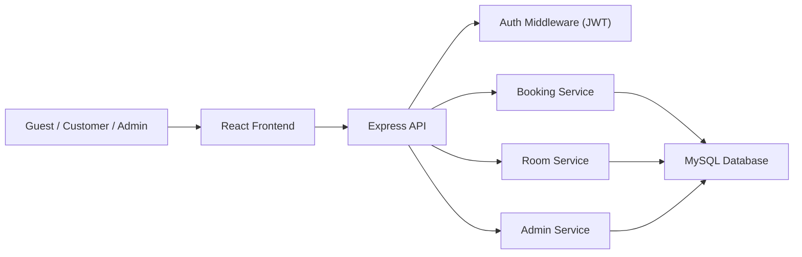
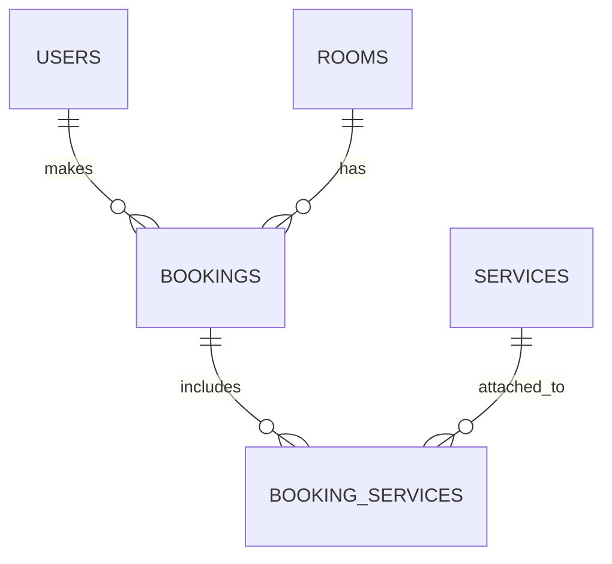

# Thiết kế hệ thống website đặt phòng khách sạn

## 1. Mục tiêu dự án

Mục tiêu là xây dựng một website đặt phòng khách sạn theo phong cách Booking.com hoặc Trip.com, nhưng vẫn đủ đơn giản để sinh viên có thể triển khai từng bước.

Hệ thống phải hỗ trợ:

- Tìm kiếm phòng khách sạn theo địa điểm, ngày ở, số người.
- Xem danh sách phòng và bộ lọc realtime.
- Xem chi tiết phòng.
- Đặt phòng, chọn thêm dịch vụ và thanh toán.
- Hủy đặt phòng.
- Xem lịch sử đặt phòng.
- Quản trị dữ liệu khách hàng, phòng, dịch vụ và booking.

Nguyên tắc thiết kế:

- Frontend ưu tiên trải nghiệm giống các nền tảng lớn.
- Backend rõ module, dễ đọc, dễ test.
- Database đủ chuẩn để phát triển thành project thực tế.
- MVP chạy được nhanh, sau đó có đường nâng cấp.

---

## 2. Stack đề xuất

## 2.1. Frontend

- `React + Vite`: nhanh, dễ học, tài liệu nhiều.
- `React Router`: điều hướng nhiều trang.
- `Tailwind CSS`: dựng UI nhanh, responsive tốt.
- `TanStack Query`: fetch API, cache, loading, refetch.
- `Zustand`: quản lý state đơn giản cho auth, search, booking draft.
- `Axios`: gọi API.

Lý do chọn stack này:

- Dễ học hơn Next.js cho sinh viên mới làm fullstack.
- Tách rõ UI state và server state.
- Phù hợp trang danh sách có filter realtime và nhiều request.

## 2.2. Backend

- `Node.js + Express`.
- `JWT` cho xác thực.
- `bcrypt` để mã hóa mật khẩu.
- `MySQL 8` cho database.
- `mysql2/promise` hoặc `Prisma`.

Khuyến nghị cho sinh viên:

- Nếu muốn hiểu rõ SQL: dùng `mysql2/promise`.
- Nếu muốn code CRUD nhanh hơn: dùng `Prisma`.

Trong tài liệu này, phần SQL được viết theo hướng dùng MySQL thuần để bạn dễ triển khai và dễ chấm đồ án.

## 2.3. Database

- `MySQL 8`.
- Chuẩn hóa ở mức vừa đủ.
- Có thể bắt đầu với 5 bảng chính theo yêu cầu và mở rộng sau.

---

## 3. Kiến trúc tổng thể



Luồng tổng quát:

1. Người dùng tìm kiếm phòng ở frontend.
2. Frontend gọi API lấy danh sách phòng theo filter.
3. Backend kiểm tra điều kiện lọc, ngày ở, số người.
4. Database trả dữ liệu phòng còn khả dụng.
5. Người dùng đăng nhập để đặt phòng.
6. Khi đặt phòng, backend dùng transaction để tránh trùng lịch.

---

## 4. Phân quyền người dùng

## 4.1. Khách chưa đăng nhập

Được phép:

- Xem trang chủ.
- Tìm kiếm phòng.
- Xem danh sách phòng.
- Xem chi tiết phòng.
- Dùng bộ lọc, sắp xếp, gợi ý.

Không được phép:

- Đặt phòng.
- Thanh toán.
- Xem lịch sử.
- Hủy booking cá nhân.

UX bắt buộc:

- Nút `Đặt ngay` vẫn hiển thị.
- Khi bấm vào, mở modal hoặc chuyển sang trang đăng nhập.
- Sau khi đăng nhập xong, quay lại đúng phòng đang xem.

## 4.2. Khách đã đăng nhập

Được phép:

- Tìm kiếm, lọc, xem chi tiết phòng.
- Đặt phòng.
- Chọn dịch vụ kèm theo.
- Thanh toán.
- Xem lịch sử booking.
- Hủy booking theo chính sách.

## 4.3. Quản lý (Admin)

Được phép:

- Xem danh sách khách hàng.
- Cập nhật thông tin khách hàng.
- Xem tất cả booking.
- Hủy booking của khách.
- Thêm, sửa, xóa phòng.
- Thêm, sửa, xóa dịch vụ.

---

## 5. Thiết kế Frontend

## 5.1. Định hướng UI/UX

Nên lấy cảm hứng từ Booking.com và Trip.com nhưng không sao chép nguyên bản.

Định hướng giao diện:

- Header xanh đậm để tạo cảm giác tin cậy.
- Thanh tìm kiếm nổi bật với viền vàng hoặc cam nhạt.
- Card nền trắng, bo góc lớn, đổ bóng nhẹ.
- Màu nhấn cho CTA là xanh dương sáng hoặc cam đậm.
- Thẻ trạng thái dùng màu rõ ràng: xanh lá cho `còn phòng`, xám hoặc đỏ nhạt cho `hết phòng`.

Design token gợi ý:

- `Primary`: `#0F4C81`
- `Primary Hover`: `#0A3A62`
- `Accent`: `#F4B400`
- `Success`: `#1F9D55`
- `Danger`: `#E5484D`
- `Background`: `#F5F7FA`
- `Card`: `#FFFFFF`
- `Text`: `#1F2937`
- `Subtext`: `#6B7280`

Font gợi ý:

- `Be Vietnam Pro` hoặc `Plus Jakarta Sans`.

Lý do:

- Hỗ trợ tiếng Việt đẹp hơn font mặc định.
- Tạo cảm giác hiện đại hơn Bootstrap thuần.

## 5.2. Cấu trúc trang

### Trang chủ

Thành phần chính:

- Header.
- Hero banner.
- Thanh tìm kiếm lớn.
- Khu ưu đãi hoặc phòng nổi bật.
- Gợi ý theo lịch sử tìm kiếm.
- Footer.

Chức năng:

- Nhập địa điểm.
- Chọn ngày nhận/trả phòng.
- Chọn số người.
- Chọn loại phòng nếu cần.
- Chuyển sang trang danh sách phòng với query string.

### Trang danh sách phòng

Đây là trang quan trọng nhất, cần tối ưu mạnh về UX.

Thành phần:

- Thanh tìm kiếm thu gọn ở đầu trang.
- Sidebar filter bên trái.
- Khu kết quả bên phải.
- Thanh sort.
- Danh sách card phòng.
- Khu gợi ý phòng tương tự.

### Trang chi tiết phòng

Thành phần:

- Gallery ảnh lớn.
- Tên phòng, địa chỉ, đánh giá.
- Giá theo đêm và giá tổng.
- Tiện nghi.
- Chính sách hủy.
- Mô tả chi tiết.
- Danh sách dịch vụ đi kèm.
- Nút đặt phòng.

### Trang đặt phòng

Thành phần:

- Tóm tắt phòng.
- Form thông tin khách hàng.
- Chọn dịch vụ cộng thêm.
- Tóm tắt giá.
- Chọn phương thức thanh toán.
- Nút xác nhận.

### Trang lịch sử đặt phòng

Thành phần:

- Danh sách booking của người dùng.
- Tabs theo trạng thái: `sắp tới`, `đã hoàn thành`, `đã hủy`.
- Nút xem chi tiết.
- Nút hủy nếu còn hiệu lực.

### Trang đăng nhập / đăng ký

Thành phần:

- Form đơn giản, rõ ràng.
- Hỗ trợ chuyển qua lại giữa đăng nhập và đăng ký.
- Validate realtime.
- Sau đăng nhập, chuyển về trang trước đó.

### Trang quản lý admin

Các tab nên có:

- Dashboard tổng quan.
- Quản lý khách hàng.
- Quản lý phòng.
- Quản lý booking.
- Quản lý dịch vụ.

---

## 6. Trang danh sách phòng: thiết kế cực kỳ chi tiết

## 6.1. Mục tiêu UX của trang này

Trang danh sách phòng phải giúp người dùng:

- Tìm được phòng phù hợp trong ít thao tác.
- So sánh nhanh nhiều lựa chọn.
- Nhìn thấy ngay giá, đánh giá, trạng thái còn phòng.
- Thay đổi filter mà không reload trang.
- Có cảm giác mượt như các nền tảng lớn.

## 6.2. Layout desktop

Gợi ý bố cục:

- Container chính rộng khoảng `1280px`.
- Chia làm `2 cột`.
- Cột trái là `Sidebar Filter`, rộng khoảng `280px - 320px`.
- Cột phải là `Results Area`, chiếm phần còn lại.

Thứ tự hiển thị:

1. Header.
2. Thanh tìm kiếm sticky ở trên cùng.
3. Dòng tóm tắt kết quả:
   - `120 phòng tại Đà Nẵng`
   - `22/04 - 24/04`
   - `2 người lớn`
4. Thanh sort:
   - Giá thấp nhất
   - Đánh giá cao nhất
   - Phổ biến nhất
   - Gần trung tâm
5. Danh sách card phòng.
6. Khu gợi ý phòng tương tự hoặc `Bạn có thể thích`.

## 6.3. Layout mobile

Trên mobile không nên giữ sidebar cố định.

Cách làm:

- Filter chuyển thành nút `Bộ lọc`.
- Khi bấm, mở drawer từ dưới lên hoặc từ phải qua.
- Sort để thành dropdown.
- Card phòng chuyển thành layout dọc.
- Nút `Đặt ngay` hoặc `Xem chi tiết` luôn nằm rõ ở cuối card.

Sticky mobile bar gợi ý:

- `Bộ lọc`
- `Sắp xếp`
- `Bản đồ` nếu có

## 6.4. Sidebar bộ lọc

Sidebar nên `sticky` khi người dùng cuộn trang.

Các nhóm filter:

### 1. Giá

- Slider khoảng giá.
- Input min/max.
- Preset nhanh:
  - Dưới 500.000đ
  - 500.000đ - 1.000.000đ
  - 1.000.000đ - 2.000.000đ
  - Trên 2.000.000đ

### 2. Số người

- 1 người
- 2 người
- 3 người
- 4+ người

### 3. Loại phòng

- Standard
- Deluxe
- Superior
- Suite
- Family

### 4. Tiện nghi

- Wi-Fi miễn phí
- Điều hòa
- Bữa sáng
- Hồ bơi
- Chỗ đậu xe
- Ban công
- Tivi
- Máy sấy tóc

### 5. Đánh giá

- Từ 9.0 trở lên
- Từ 8.0 trở lên
- Từ 7.0 trở lên

### 6. Chính sách

- Hủy miễn phí
- Thanh toán tại khách sạn
- Bao gồm bữa sáng

UX của sidebar:

- Có nút `Xóa bộ lọc`.
- Filter đang chọn hiển thị thành chips ở phía trên danh sách.
- Checkbox và slider phải phản hồi ngay.
- Trên desktop, khi đổi filter thì danh sách cập nhật realtime.

## 6.5. Khu vực hiển thị danh sách phòng

Mỗi card phòng nên chia thành `3 vùng`.

### Vùng 1: Ảnh

- Ảnh bìa kích thước lớn.
- Bo góc trái card.
- Lazy loading ảnh.
- Placeholder blur hoặc skeleton trước khi ảnh tải xong.
- Có badge như:
  - `Ưu đãi hôm nay`
  - `Bán chạy`
  - `Còn 2 phòng`

### Vùng 2: Thông tin chính

- Tên phòng hoặc tên khách sạn.
- Loại phòng.
- Địa chỉ.
- Khoảng cách tới trung tâm hoặc điểm nổi bật.
- Tiện nghi nổi bật dạng chips.
- Mô tả ngắn 2 dòng.
- Chính sách hoàn hủy.

### Vùng 3: Giá và hành động

- Điểm đánh giá lớn.
- Số lượt đánh giá.
- Giá cũ nếu có khuyến mãi.
- Giá hiện tại theo đêm.
- Giá tổng theo số đêm.
- Trạng thái:
  - `Còn phòng`
  - `Sắp hết`
  - `Hết phòng`
- Nút:
  - `Xem chi tiết`
  - `Đặt ngay`

## 6.6. Những trường dữ liệu bắt buộc trên card

Mỗi card phòng phải hiển thị tối thiểu:

- Ảnh.
- Tên phòng.
- Địa chỉ.
- Giá.
- Điểm đánh giá.
- Nút đặt phòng.
- Trạng thái còn phòng.

Nên có thêm:

- Chính sách hủy miễn phí.
- Bữa sáng có sẵn hay không.
- Số người tối đa.
- Tiện nghi chính.

## 6.7. Hiệu ứng UX/UI cần có

### Hover card

Khi rê chuột vào card:

- Card nhấc nhẹ lên `translateY(-2px)`.
- Shadow đậm hơn.
- Ảnh zoom nhẹ `scale(1.03)`.
- Nút CTA sáng hơn.

### Hover filter

- Checkbox có vùng bấm lớn.
- Chip filter có nút `x`.
- Nhóm filter mở/đóng mượt.

### Transition

- Thời gian animation khoảng `150ms - 250ms`.
- Không dùng animation dài gây nặng.

## 6.8. Loading state

Trang danh sách phải có:

### Skeleton loading

Khi API đang fetch:

- Sidebar vẫn hiển thị.
- Danh sách bên phải hiển thị 6 skeleton card.

Skeleton card gồm:

- Khối ảnh màu xám nhạt.
- 2 đến 3 dòng chữ giả.
- Khối giá.
- Nút giả.

### Lazy loading ảnh

Chỉ tải ảnh khi card gần xuất hiện trong viewport.

Kết hợp:

- `loading="lazy"`
- Intersection Observer nếu cần kiểm soát tốt hơn.

## 6.9. Empty state

Nếu không có kết quả:

- Hiển thị thông báo thân thiện:
  - `Không tìm thấy phòng phù hợp với bộ lọc hiện tại.`
- Có nút:
  - `Xóa bộ lọc`
  - `Xem phòng tương tự`
- Gợi ý đổi ngày hoặc giảm điều kiện filter.

## 6.10. Error state

Nếu API lỗi:

- Thông báo ngắn.
- Nút `Thử lại`.
- Không làm crash cả trang.

## 6.11. Gợi ý phòng tương tự

Hiển thị ở 2 vị trí phù hợp:

### Cách 1

- Sau 4 đến 6 card đầu tiên, chèn một cụm `Phòng tương tự`.

### Cách 2

- Ở cuối trang danh sách.

Logic gợi ý:

- Cùng thành phố.
- Cùng loại phòng.
- Mức giá gần tương đương.
- Dựa trên lịch sử xem hoặc lịch sử tìm kiếm.

## 6.12. Hiển thị trạng thái phòng

Nên dùng badge rõ ràng:

- `Còn phòng`: xanh lá.
- `Sắp hết`: cam.
- `Hết phòng`: xám hoặc đỏ nhạt.

Logic:

- `available_count > 5` => `Còn phòng`
- `available_count từ 1 đến 5` => `Sắp hết`
- `available_count = 0` => `Hết phòng`

Nếu `Hết phòng`:

- Vẫn cho xem chi tiết.
- Disable nút `Đặt ngay`.
- Gợi ý phòng thay thế.

## 6.13. Realtime filter không reload

Trạng thái filter nên đồng bộ qua:

- URL query string.
- React state.
- LocalStorage cho lịch sử tìm kiếm.

Ví dụ query string:

```txt
/rooms?city=danang&checkIn=2026-04-22&checkOut=2026-04-24&guests=2&minPrice=500000&maxPrice=1500000&rating=8
```

Lợi ích:

- Reload trang vẫn giữ filter.
- Copy link chia sẻ được.
- Dễ SEO hơn nếu cần.

Luồng realtime filter:

1. Người dùng đổi filter.
2. Cập nhật state local.
3. Sync lên URL.
4. Gọi API với debounce `300ms` cho input/slider.
5. Danh sách cập nhật mà không reload toàn trang.

## 6.14. Lưu lịch sử tìm kiếm bằng LocalStorage

Nên lưu:

- Địa điểm đã tìm.
- Khoảng ngày.
- Số khách.
- Mức giá thường chọn.

Ví dụ key:

```txt
recent_hotel_searches
```

Ví dụ dữ liệu:

```json
[
  {
    "city": "Hà Nội",
    "checkIn": "2026-04-22",
    "checkOut": "2026-04-23",
    "guests": 2,
    "searchedAt": "2026-04-22T09:00:00.000Z"
  }
]
```

Ứng dụng của lịch sử:

- Tự động gợi ý địa điểm ở ô tìm kiếm.
- Hiển thị block `Bạn vừa tìm gần đây`.
- Đề xuất phòng tương tự.

## 6.15. Gợi ý dựa trên lịch sử

Nếu người dùng đã từng tìm:

- Hà Nội
- 2 người
- Khoảng giá dưới 1 triệu

Thì ở trang chủ hoặc danh sách có thể gợi ý:

- `Các phòng phù hợp với chuyến đi gần đây của bạn`

Logic gợi ý đơn giản cho MVP:

- Ưu tiên cùng thành phố.
- Nếu trùng số khách, cộng điểm.
- Nếu gần mức giá từng chọn, cộng điểm.
- Nếu cùng loại phòng, cộng điểm.

## 6.16. Responsive chi tiết

### Tablet

- Sidebar thu gọn còn `260px`.
- Card phòng vẫn giữ ảnh bên trái, thông tin bên phải.

### Mobile

- Ảnh lên trên.
- Thông tin xuống dưới.
- Giá và CTA đặt ở cuối.
- Filter dùng bottom sheet.
- Sort là dropdown.
- Nút đặt phòng rộng toàn chiều ngang.

## 6.17. Accessibility

Nên có:

- Alt text cho ảnh.
- Contrast đủ cao.
- Focus ring cho button và input.
- Có thể thao tác bằng bàn phím.
- Label rõ cho form.

## 6.18. Component nên tách ở frontend

```txt
SearchBar
SearchSummaryBar
FilterSidebar
FilterSection
ActiveFilterChips
SortBar
RoomList
RoomCard
RatingBadge
AvailabilityBadge
PriceBlock
RoomCardSkeleton
SimilarRoomsSection
EmptyState
ErrorState
```

---

## 7. Quản lý state frontend

Chia state như sau:

### UI state

Lưu bằng `useState` hoặc `Zustand`:

- Mở/đóng filter mobile.
- Sort hiện tại.
- Tab lịch sử booking.
- Booking draft đang chọn.

### Server state

Lưu bằng `TanStack Query`:

- Danh sách phòng.
- Chi tiết phòng.
- Lịch sử booking.
- Danh sách dịch vụ.
- Dữ liệu admin.

### Auth state

Lưu bằng `Zustand`:

- User info.
- JWT token.
- Role.

### LocalStorage state

- `recent_hotel_searches`
- `recent_viewed_rooms`
- `preferred_filters`

---

## 8. Đề xuất cấu trúc frontend

```txt
src/
  components/
    common/
    layout/
    rooms/
    booking/
    admin/
  pages/
    HomePage.jsx
    RoomListPage.jsx
    RoomDetailPage.jsx
    BookingPage.jsx
    BookingHistoryPage.jsx
    LoginPage.jsx
    RegisterPage.jsx
    AdminDashboardPage.jsx
  hooks/
    useAuth.js
    useSearchHistory.js
    useFilters.js
  store/
    authStore.js
    bookingStore.js
    searchStore.js
  services/
    api.js
    authApi.js
    roomApi.js
    bookingApi.js
    adminApi.js
  utils/
    currency.js
    date.js
    roomStatus.js
  routes/
    index.jsx
```

---

## 9. Thiết kế Backend

## 9.1. Các module chính

### Auth Module

- Đăng ký.
- Đăng nhập.
- Lấy thông tin user hiện tại.

### Rooms Module

- Lấy danh sách phòng.
- Lọc phòng.
- Lấy chi tiết phòng.

### Bookings Module

- Tạo booking.
- Hủy booking.
- Xem lịch sử booking của user.

### Services Module

- Lấy danh sách dịch vụ.
- Gắn dịch vụ vào booking.

### Admin Module

- Quản lý user.
- Quản lý phòng.
- Quản lý booking.
- Quản lý dịch vụ.

### Payment Module

- MVP có thể làm `thanh toán giả lập`.
- Sau này tích hợp VNPay, MoMo hoặc Stripe.

## 9.2. Cấu trúc backend đề xuất

```txt
server/
  src/
    config/
      db.js
      env.js
    middlewares/
      auth.middleware.js
      role.middleware.js
      error.middleware.js
    modules/
      auth/
        auth.controller.js
        auth.service.js
        auth.routes.js
      rooms/
        room.controller.js
        room.service.js
        room.routes.js
      bookings/
        booking.controller.js
        booking.service.js
        booking.routes.js
      services/
        service.controller.js
        service.service.js
        service.routes.js
      admin/
        admin.controller.js
        admin.service.js
        admin.routes.js
    utils/
      jwt.js
      hash.js
      validator.js
    app.js
    server.js
```

---

## 10. API cần có

## 10.1. Auth API

### `POST /api/auth/register`

Mục đích:

- Tạo tài khoản khách hàng.

Body:

```json
{
  "fullName": "Nguyen Van A",
  "email": "a@gmail.com",
  "password": "123456",
  "phone": "0909123456"
}
```

### `POST /api/auth/login`

Mục đích:

- Đăng nhập và trả JWT.

### `GET /api/auth/me`

Mục đích:

- Lấy thông tin user hiện tại.

Yêu cầu:

- Token hợp lệ.

## 10.2. Room API

### `GET /api/rooms`

Mục đích:

- Lấy danh sách phòng theo filter.

Query params:

- `city`
- `checkIn`
- `checkOut`
- `guests`
- `minPrice`
- `maxPrice`
- `roomType`
- `amenities`
- `rating`
- `sort`
- `page`
- `limit`

### `GET /api/rooms/:id`

Mục đích:

- Lấy chi tiết một phòng.

### `GET /api/rooms/similar/:id`

Mục đích:

- Lấy phòng tương tự.

## 10.3. Booking API

### `POST /api/bookings`

Mục đích:

- Tạo booking mới.

Yêu cầu:

- Phải đăng nhập.

Body:

```json
{
  "roomId": 12,
  "checkInDate": "2026-04-22",
  "checkOutDate": "2026-04-24",
  "guests": 2,
  "serviceIds": [1, 3],
  "paymentMethod": "mock"
}
```

### `GET /api/bookings/my`

Mục đích:

- Xem lịch sử booking của user hiện tại.

### `PATCH /api/bookings/:id/cancel`

Mục đích:

- Hủy booking của chính người dùng.

Điều kiện:

- Chỉ hủy được booking chưa check-in.
- Có thể thêm điều kiện trước 24h.

## 10.4. Admin API

### User management

- `GET /api/admin/users`
- `PATCH /api/admin/users/:id`

### Room management

- `GET /api/admin/rooms`
- `POST /api/admin/rooms`
- `PUT /api/admin/rooms/:id`
- `DELETE /api/admin/rooms/:id`

### Booking management

- `GET /api/admin/bookings`
- `PATCH /api/admin/bookings/:id/cancel`

### Service management

- `GET /api/admin/services`
- `POST /api/admin/services`
- `PUT /api/admin/services/:id`
- `DELETE /api/admin/services/:id`

---

## 11. Logic backend quan trọng

## 11.1. Kiểm tra phòng trống theo ngày

Điều kiện trùng lịch chuẩn:

```txt
newCheckIn < existingCheckOut
AND newCheckOut > existingCheckIn
```

Nghĩa là:

- Nếu booking mới chạm vào vùng thời gian đã có booking thì bị xem là trùng.

Ví dụ:

- Booking cũ: `22/04 -> 24/04`
- Booking mới: `23/04 -> 25/04`
- Kết quả: trùng lịch.

## 11.2. Tránh trùng lịch đặt phòng

Khi tạo booking:

1. Validate dữ liệu đầu vào.
2. Kiểm tra ngày hợp lệ:
   - `checkIn < checkOut`
   - `checkIn >= today`
3. Mở transaction.
4. Kiểm tra số booking đang chồng ngày của phòng đó.
5. So sánh với `inventory_count`.
6. Nếu còn chỗ:
   - Tạo booking.
   - Tạo booking_services nếu có.
7. Commit transaction.
8. Nếu lỗi thì rollback.

## 11.3. Trạng thái booking

Nên dùng các trạng thái:

- `PENDING`
- `CONFIRMED`
- `CANCELLED`
- `COMPLETED`

Có thể thêm:

- `PENDING_PAYMENT`
- `REFUNDED`

MVP gợi ý:

- Sau khi thanh toán giả lập thành công => `CONFIRMED`
- User hủy => `CANCELLED`
- Sau ngày trả phòng => `COMPLETED`

## 11.4. Tính tổng tiền booking

Công thức:

```txt
total_nights = DATEDIFF(check_out_date, check_in_date)
room_total = total_nights * price_per_night
service_total = tổng giá dịch vụ
grand_total = room_total + service_total
```

## 11.5. Hủy booking

Luồng:

1. Kiểm tra booking có thuộc user đó không, trừ khi là admin.
2. Kiểm tra trạng thái hiện tại.
3. Nếu đủ điều kiện hủy:
   - Cập nhật trạng thái `CANCELLED`
   - Ghi `cancelled_at`
4. Trả kết quả cho frontend cập nhật ngay.

---

## 12. Thiết kế Database SQL

## 12.1. Quy ước đơn giản cho mô hình dữ liệu

Để giữ đúng yêu cầu tối thiểu 5 bảng, có thể hiểu:

- `rooms` là đơn vị phòng được bán trên hệ thống.
- Bảng này giữ luôn một số thông tin hiển thị như tên khách sạn, địa chỉ, tiện nghi, ảnh bìa.

Điểm mạnh:

- Dễ làm đồ án.
- Ít bảng hơn.

Điểm hạn chế:

- Sau này nếu muốn tách nhiều khách sạn và nhiều loại phòng, nên thêm bảng `hotels`, `room_images`, `reviews`, `amenities`.

## 12.2. Quan hệ giữa các bảng



Giải thích:

- Một `User` có nhiều `Bookings`.
- Một `Room` có nhiều `Bookings`.
- Một `Booking` có thể có nhiều `Services`.
- Một `Service` có thể xuất hiện ở nhiều `Bookings`.

## 12.3. SQL tạo bảng

```sql
CREATE TABLE users (
    id BIGINT PRIMARY KEY AUTO_INCREMENT,
    full_name VARCHAR(120) NOT NULL,
    email VARCHAR(150) NOT NULL UNIQUE,
    password_hash VARCHAR(255) NOT NULL,
    phone VARCHAR(20),
    role ENUM('customer', 'admin') NOT NULL DEFAULT 'customer',
    status ENUM('active', 'inactive') NOT NULL DEFAULT 'active',
    created_at TIMESTAMP DEFAULT CURRENT_TIMESTAMP,
    updated_at TIMESTAMP DEFAULT CURRENT_TIMESTAMP ON UPDATE CURRENT_TIMESTAMP
);

CREATE TABLE rooms (
    id BIGINT PRIMARY KEY AUTO_INCREMENT,
    hotel_name VARCHAR(150) NOT NULL,
    room_name VARCHAR(150) NOT NULL,
    slug VARCHAR(180) NOT NULL UNIQUE,
    city VARCHAR(100) NOT NULL,
    address VARCHAR(255) NOT NULL,
    room_type ENUM('standard', 'deluxe', 'superior', 'suite', 'family') NOT NULL,
    description TEXT,
    amenities_json JSON NULL,
    image_url VARCHAR(500),
    gallery_json JSON NULL,
    price_per_night DECIMAL(12,2) NOT NULL,
    rating_avg DECIMAL(3,1) NOT NULL DEFAULT 0,
    total_reviews INT NOT NULL DEFAULT 0,
    max_guests INT NOT NULL,
    inventory_count INT NOT NULL DEFAULT 1,
    breakfast_included BOOLEAN NOT NULL DEFAULT FALSE,
    free_cancellation BOOLEAN NOT NULL DEFAULT FALSE,
    is_active BOOLEAN NOT NULL DEFAULT TRUE,
    created_at TIMESTAMP DEFAULT CURRENT_TIMESTAMP,
    updated_at TIMESTAMP DEFAULT CURRENT_TIMESTAMP ON UPDATE CURRENT_TIMESTAMP
);

CREATE TABLE bookings (
    id BIGINT PRIMARY KEY AUTO_INCREMENT,
    user_id BIGINT NOT NULL,
    room_id BIGINT NOT NULL,
    check_in_date DATE NOT NULL,
    check_out_date DATE NOT NULL,
    guests INT NOT NULL,
    nights INT NOT NULL,
    room_price DECIMAL(12,2) NOT NULL,
    service_price DECIMAL(12,2) NOT NULL DEFAULT 0,
    total_price DECIMAL(12,2) NOT NULL,
    booking_status ENUM('pending', 'confirmed', 'cancelled', 'completed') NOT NULL DEFAULT 'pending',
    payment_status ENUM('unpaid', 'paid', 'refunded') NOT NULL DEFAULT 'unpaid',
    payment_method VARCHAR(50),
    booked_at TIMESTAMP DEFAULT CURRENT_TIMESTAMP,
    cancelled_at TIMESTAMP NULL,
    note VARCHAR(255) NULL,
    CONSTRAINT fk_bookings_user FOREIGN KEY (user_id) REFERENCES users(id),
    CONSTRAINT fk_bookings_room FOREIGN KEY (room_id) REFERENCES rooms(id)
);

CREATE TABLE services (
    id BIGINT PRIMARY KEY AUTO_INCREMENT,
    service_name VARCHAR(120) NOT NULL,
    description VARCHAR(255),
    price DECIMAL(12,2) NOT NULL,
    service_type ENUM('food', 'transport', 'spa', 'entertainment', 'other') NOT NULL DEFAULT 'other',
    is_active BOOLEAN NOT NULL DEFAULT TRUE,
    created_at TIMESTAMP DEFAULT CURRENT_TIMESTAMP,
    updated_at TIMESTAMP DEFAULT CURRENT_TIMESTAMP ON UPDATE CURRENT_TIMESTAMP
);

CREATE TABLE booking_services (
    id BIGINT PRIMARY KEY AUTO_INCREMENT,
    booking_id BIGINT NOT NULL,
    service_id BIGINT NOT NULL,
    quantity INT NOT NULL DEFAULT 1,
    unit_price DECIMAL(12,2) NOT NULL,
    total_price DECIMAL(12,2) NOT NULL,
    CONSTRAINT fk_booking_services_booking FOREIGN KEY (booking_id) REFERENCES bookings(id),
    CONSTRAINT fk_booking_services_service FOREIGN KEY (service_id) REFERENCES services(id)
);
```

## 12.4. Query kiểm tra phòng còn trống

Nếu mỗi bản ghi `rooms` đại diện cho một loại phòng có số lượng `inventory_count`, query phù hợp là:

```sql
SELECT
    r.id,
    r.hotel_name,
    r.room_name,
    r.city,
    r.address,
    r.price_per_night,
    r.rating_avg,
    r.inventory_count,
    (r.inventory_count - COUNT(b.id)) AS available_count
FROM rooms r
LEFT JOIN bookings b
    ON b.room_id = r.id
    AND b.booking_status IN ('pending', 'confirmed')
    AND ('2026-04-22' < b.check_out_date AND '2026-04-24' > b.check_in_date)
WHERE r.is_active = TRUE
  AND r.city = 'Ha Noi'
  AND r.max_guests >= 2
GROUP BY r.id
HAVING available_count > 0
ORDER BY r.price_per_night ASC;
```

Ý nghĩa:

- Join các booking đang chồng ngày.
- Đếm số booking trùng.
- Lấy `inventory_count - số booking trùng`.
- Chỉ giữ các phòng còn lớn hơn `0`.

## 12.5. Query lấy lịch sử booking của một user

```sql
SELECT
    b.id,
    r.hotel_name,
    r.room_name,
    r.image_url,
    b.check_in_date,
    b.check_out_date,
    b.total_price,
    b.booking_status,
    b.payment_status,
    b.booked_at
FROM bookings b
JOIN rooms r ON r.id = b.room_id
WHERE b.user_id = 5
ORDER BY b.booked_at DESC;
```

## 12.6. Query lấy danh sách dịch vụ của một booking

```sql
SELECT
    bs.booking_id,
    s.service_name,
    bs.quantity,
    bs.unit_price,
    bs.total_price
FROM booking_services bs
JOIN services s ON s.id = bs.service_id
WHERE bs.booking_id = 1001;
```

---

## 13. Response mẫu cho frontend

## 13.1. Response danh sách phòng

```json
{
  "data": [
    {
      "id": 12,
      "hotelName": "Ha Thanh Lake View",
      "roomName": "Deluxe Lake View",
      "city": "Ha Noi",
      "address": "41 P. Trich Sai, Tay Ho, Ha Noi",
      "imageUrl": "https://example.com/room-12.jpg",
      "pricePerNight": 850000,
      "ratingAvg": 8.8,
      "totalReviews": 143,
      "maxGuests": 2,
      "availableCount": 3,
      "roomType": "deluxe",
      "amenities": ["wifi", "air_conditioner", "breakfast"],
      "freeCancellation": true
    }
  ],
  "pagination": {
    "page": 1,
    "limit": 10,
    "totalItems": 120,
    "totalPages": 12
  }
}
```

## 13.2. Response lịch sử booking

```json
{
  "data": [
    {
      "id": 1001,
      "hotelName": "Ha Thanh Lake View",
      "roomName": "Deluxe Lake View",
      "checkInDate": "2026-04-22",
      "checkOutDate": "2026-04-24",
      "totalPrice": 2100000,
      "bookingStatus": "confirmed",
      "paymentStatus": "paid"
    }
  ]
}
```

---

## 14. Luồng đặt phòng hoàn chỉnh

1. User tìm kiếm phòng ở trang chủ.
2. Chuyển sang trang danh sách với query string.
3. User lọc và chọn một phòng.
4. Vào trang chi tiết phòng.
5. Bấm `Đặt ngay`.
6. Nếu chưa đăng nhập:
   - Chuyển sang login.
   - Login xong quay lại trang booking.
7. User nhập thông tin, chọn dịch vụ đi kèm.
8. Frontend gọi `POST /api/bookings`.
9. Backend kiểm tra availability bằng transaction.
10. Nếu hợp lệ:
    - Tạo booking.
    - Tạo booking_services.
    - Trả booking thành công.
11. Frontend chuyển sang trang xác nhận.

---

## 15. Những điểm nên ưu tiên để giống website lớn

Không cần làm quá nhiều tính năng ngay từ đầu. Chỉ cần làm tốt các điểm sau là giao diện đã có cảm giác chuyên nghiệp:

- Search bar lớn, rõ, dễ thao tác.
- Filter sidebar sticky.
- Card phòng bố cục rõ ràng, thông tin không rối.
- Skeleton loading và lazy loading ảnh.
- Trạng thái còn phòng hiển thị nổi bật.
- Giá theo đêm và tổng giá thể hiện rõ.
- Realtime filter không reload trang.
- Responsive mobile chỉn chu.
- Lưu lịch sử tìm kiếm và gợi ý thông minh.

---

## 16. Kế hoạch triển khai cho sinh viên

## Giai đoạn 1: MVP

- Làm auth.
- Làm danh sách phòng.
- Làm chi tiết phòng.
- Làm đặt phòng.
- Làm lịch sử booking.
- Làm admin CRUD phòng và dịch vụ.

## Giai đoạn 2: Nâng cấp UX

- Lưu lịch sử tìm kiếm.
- Gợi ý theo lịch sử.
- Skeleton loading.
- Similar rooms.
- Tối ưu mobile.

## Giai đoạn 3: Nâng cấp thực tế

- Tích hợp thanh toán thật.
- Upload nhiều ảnh.
- Review người dùng.
- Wishlist.
- Coupon.
- Dashboard doanh thu.

---

## 17. Kết luận

Phương án phù hợp nhất cho đồ án và vẫn có khả năng phát triển tiếp là:

- Frontend: `React + Vite + Tailwind + TanStack Query + Zustand`
- Backend: `Node.js + Express + JWT`
- Database: `MySQL`

Nếu bạn muốn bám sát trải nghiệm như Booking/Trip, phần cần đầu tư nhất không phải là trang đăng nhập hay admin, mà là:

- `Search bar`
- `Trang danh sách phòng`
- `Card phòng`
- `Chi tiết phòng`
- `Luồng đặt phòng`

Đó là 5 khu vực quyết định cảm giác chuyên nghiệp của toàn bộ website.

---

## 18. Hướng mở rộng nên thêm sau này

Nếu muốn đi xa hơn sau khi MVP hoàn thành, có thể thêm:

- Bảng `hotels`
- Bảng `room_images`
- Bảng `reviews`
- Bảng `amenities`
- Tìm trên bản đồ
- So sánh phòng
- Coupon giảm giá
- Yêu thích phòng
- Email xác nhận booking
